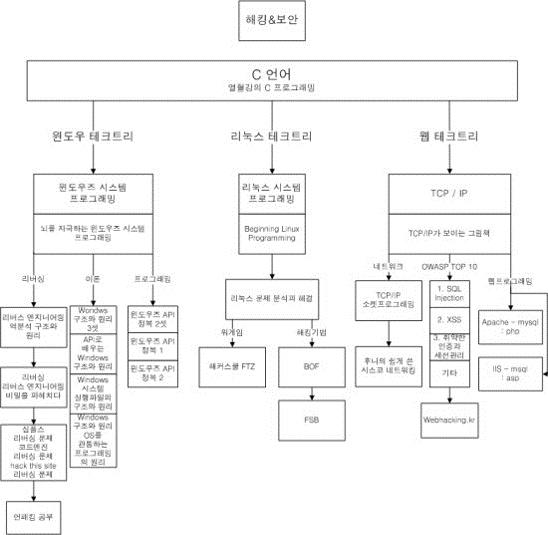
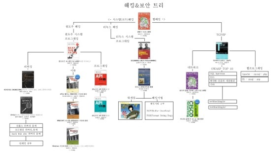

##초보자를 위한 시스템 해킹 공부 가이드라인 [홍승표 作](https://www.facebook.com/HSPantom)(a.k.a Phantom)
---
 
## 1. 기본기
- **C언어**, 객체 지향언어(C++, JAVA, Python etc...)중 하나 (개념이라도)
- **리눅스**
- **네트워크 기초** (네트워크의 개념, 각 패킷의 형태, OSI 7 Layer, 라우터, 스위치 정도만이라도

- **TechTree 1**

 

- **TechTree 2**

 

## 2. 전문분야

**1. Pwnable**  
**2. Reversing**
 

### 2.1. Pwnable
- ** 추천 공부 순서**  
**1. ==달고나 문서==**  
**2. ++Hackerz on the ship++ - 우리 집에 gdb있는데.. 메모리 보고갈래?**  
**3. ++HackerSchool++[^1] FTZ traing 1~10, Level 1~20**  
**4. HackerSchool Load of BOF 1~20**  
**5. HackerSchool FC3**

- 처음에는 ==달고나 문서==와 Hackerz on the ship의 문서를 읽는 것을 추천.[^2] 리버싱도 마찬가지.  
- **여기까지 하는데도 상당한 시간이 걸린다.**  
- Training 1~10, Level 1~9까지는 처음에 왜 하는지 잘 이해가 가지 않을 수 있으나, 한번하고 나중에 다시보게 된다면 왜 이것을 했는지 이해할 수 있으며, 공부하면서 프로그래밍 등 기초가 흔들리는 자신의 모습을 볼 수 있을것.  

> **Phantom의 의견**
>
> 처음 공부할 때 어떻게 해야 할 지 몰라서 '문제 풀이로 배우는 시스템 해킹 테크닉'이라는 FTZ문제 풀이 책을 봤다. 이해가 가는 부분도 있고, 가지 않는 부분도 있을 것이다. 적어도 한번정도는 이해가 안가는 부분을 최대한 해보고, 그래도 안되면 **다음을 기약하며** 넘기고 앞으로 계속 가기를 바란다.
>
> FTZ를 풀고 LOB까지? FC3까지는 처음 혼자 해보다 잘 안되면 **풀이를 보고 공부했다. 그리고 다시 풀이를 보지 않고 공부를 했다.**
>
> 해커스쿨의 각종 문서들과 발표자료 등 필요할 때 매우 자주 찾아보는 것을 추천한다.
>
> 그리고 문제풀이 라는 것은 FTZ Level9?부터 익스플로잇 코드까지 작성하는 것을 푸는 것이라 생각하는 것이 좋다.

 
- **이후 추천 공부 순서**  
**1. exploit-exercises.com - Nebula, Protostar, Fusion**  
**2. OvertheWire - votex**  
**3. Pwnable.kr**  

- 이미 여기까지 할 수 있는 실력이라면 해킹방어대회(CTF)에 참가하면 순위권 안에 들지도 모른다.
- Phantom이 공부한 책으로는 시스템 해킹 테크닉(FTZ), 해킹 공격의 예술이 Pwnable에는 해당되는 것 같다.
- 대부분이 문서로 존재한다.
---

### 2.2 Reversing

- **추천 공부 순서**  
**1. Abex's Crackme 1~5**  
**2. CodeEngn Basic RCE 1~20**  
**3. Simples.kr Season 1 Crack, Unpack, Season 2 Reverse**  
**4. CodeEngn Advanced RCE 1~18**  
**5. Reversing.kr**  

> **Phantom의 의견**
>
> 처음 Reversing을 공부했을 때, 흔히 나뭇잎책, 방독면책 하는 바이블이라 불리는 책을 보면서 공부를 하는데, ++하나도 몰랐다!!!++
>
> 책을 따라가며 부분부분 이해하며 넘기긴 하는데, 정신을 차리면 영혼이 잠시 마실 나갔다 온 것처럼 기억을 못했고, 어셈블리어 한 줄 한 줄은 알겠는데, 전체적인 흐름이 보이지 않았다.
>
> 이런 이유로 리버싱을 자주 포기했었고, 거의 포기했다. **역시 달고나 문서와 Hackerz on the ship의 문서를 읽길 바란다.**
>
> 멘토님이 한가지 과제를 주셨는데, Simples.kr Crackme 1~20 1번 Writeup 보고 풀고 1주일 후에 보고서 제출이었다. 진짜 더럽게 이해 안가고 그랬지만 1주일 안에 했다. 그리고 지금, 다시 문제를 푸니 전체적인 개념이 조금이나마 깃들어 있어 혼자 풀기 시작한다. 심지어 아주 쉬운 CTF문제 하나도 혼자 풀었다.
>
> 공부한 책으로는 나뭇잎, 방독면 등등 두 세 개 있는 것 같은데 대부분 레퍼런스로 보고 있다.
>
> 어셈블리어를 체화 하는 것에는 **핸드레이**(Hand+hex-ray)[^3]가 좋다. C를 어셈으로, 어셈을 C로 풀어보는 것으로, 이것은 개인적인 의견이 아니라 대표님들이, 악성코드 분석 현업에 계신 분들이 말씀해 주신 것을 토대로 하는 이야기다.
>
> 이정도 할 생각이면 Pwnable이든, Reversing이든 크게 심적으로 힘들지 않을 것이다.
>
> 그리고 나뭇잎과 같은 책들은 처음엔 많이 어려울 수 있다. 하지만 선행학습이 된다면 그 내용들이 쉬워질 것이다. 나 또한 지금에서야 깨달은 것이지만 매우 쉽다. 아직 앞부분만이지만.
>
> 그 이후 PE부분부터는 OS지식에 대한 것이 부족하다는 것을 느낄 것이다. 그 때 부터 기본을 쌓기 시작할 수도 있다.
>
> Crackme를 풀 때부터 Windows API를 보고 그럴 것이다. 그러면서 기초가 쌓인다. Codeengn은 시스템의 해커스쿨과 비슷한 곳이다. 그곳에서 문서를 쉽게 찾을 수 있을 것이다.

## 3. 마무리

Pwnable이든 Reversing이든 어느 정도의 기초지식은 Wargame을 통해 Writeup을 보고 먼저 한바퀴 만큼은 풀길 바란다. 그 이유는 적어도 이것이 어떤 것이라는 ++적응++이 필요하기 때문이다. (특히 Reversing) 그리고 다시 돌아와서 제대로 공부하기를 바라며, 처음에 영혼없이 하더라도 이것이 어떤 것인지는 인식을 하고 있어야 한다.

공부하는 방법을 알아내는 것도 실력이고, 뭘 공부해야할지 알아내는 것도 실력이며, 뭘 공부할지 모를 때 오는 슬럼프를 극복하는 것도 실력이다.

어차피 공부하는 것은 혼자이다. 스터디에 들었다고, 팀에 들었다고 절대 내 실력이 오르는 것이 아니다. 이 생각이 제일 위험하고 자만하면 안된다.

**스스로 찾고 해결해 나가는 것이 중요하다.**

## #1. 공부에 도움이 되는 사이트들

|분류|관련사이트|비고|
|-|-|-|
|침해사고 대응|http://securitypractice.or.kr/index.php|KISA에서 운영하는 침해사고 대응 훈련장|
|모의해킹|http://hackerschool.org|시스템 해킹 실습 환경 제공 및 기타 정보들|
||http://www.wechall.net|전세계 해킹 실습환경을 한곳에 모아둔 사이트|
||http://webhacking.kr|웹 해킹 문제 풀이 사이트|
||http://codeengn.com|해킹관련 문서가 다량 보유된 사이트|
||http://xcz.kr/START/challenge.php|다양한 분야의 문제가 혼용된 사이트|
||https://www.corelan.be/index.php/articles/|리버싱 등에 관한 상세한 기사들이 다수 존재하는 곳(영문)|
||http://www.droidsec.org/wiki/#whitepapers|안드로이드 해킹에 대한 모든 정보가 있는 곳|
||https://www.ietf.org/rfc.html|네트워크 프로토콜 RFC 자료|
||http://www.owasp.net|OWASP, ESAPI등 관련 정보가 있는 곳|
||http://resources.infosecinstitute.com|아주 쉬운 기술 자료들이 모여있는 곳. 샘플도 제공(영문)|
||http://www.wowhacker.com|언더해커 모임|
|프로그래밍|http://www.pythonchallenge.com|Python 문제 풀이 사이트|
|포렌식|http://maj3sty.tistory.com|개인이 운영하는 블로그로 포렌식 관련 자료 다수 보유|
||http://forensic-proof.com|플레인비트 김진국 대표가 운영하는 블로그|

## #2. Reference to

- 보안 전문가의 길 (http://www.slideshare.net/seokhunhwnag/2015-v09\)
- 시스템 보안이란? (https://www.facebook.com/groups/438543032874514/1074936635901814/\)
- 달고나 문서 (http://www.hackerschool.org/HS_Boards/data/Lib_system/buffer_overflow_foundation_pub.pdf\)
- 우리집에 gdb있는데.. 메모리 보고 갈래? (https://bpsecblog.wordpress.com/2016/03/08/%EC%9A%B0%EB%A6%AC%EC%A7%91%EC%97%90-gdb-%EC%9E%88%EB%8A%94%EB%8D%B0-%EB%A9%94%EB%AA%A8%EB%A6%AC-%EB%B3%B4%EA%B3%A0%EA%B0%88%EB%9E%98-1/\)
- 해킹 입문서, 커리큘럼, 테크트리, 리버싱 (http://blog.naver.com/93immm/130179760409\)
- Phantom이 쓴 Writeup (http://pantom.tistory.com\)

[^1]: Wargame이라고 하여 가상 OS에 취약점이 있는 환경을 만들어 각 단계에서 취약점을 공략하여 다음 단계로 올라가는 방식.  
[^2]: 적어도 어떻게 돌아가는 것인지는 알아야 Reversing이든 Pwnable이든 가능하기 때문.  
[^3]: Hax-ray를 손으로 하는 방법.
