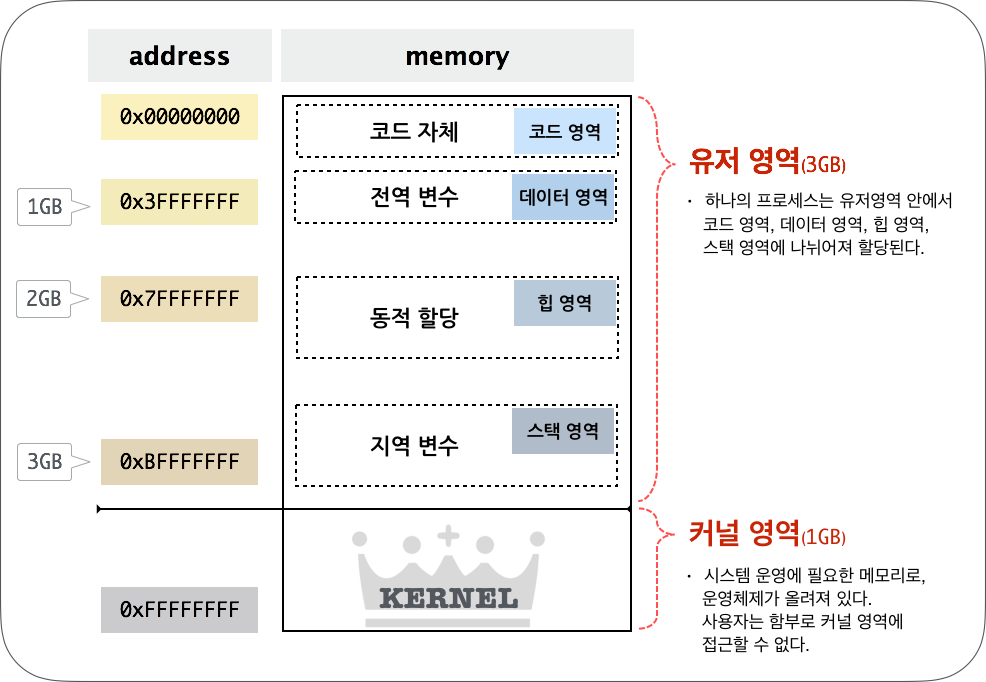

**출처 : [우리집에 GDB 있는데... 메모리 보고갈래? (1) - Hackerz on the Ship](https://bpsecblog.wordpress.com/2016/03/08/gdb_memory_1/)**

## 들어가기에 앞서...
>컴(존)알못들이여 오라.
보안 공부하다 높다란 진입장벽 앞에서 좌절하신 분들께 이 글을 바칩니다.
해커가 되겠다는 청운을 안고 대학을 입학했으나.. 4년 째 뉴비...★
컴알못인 제가 자세히 친절하게 하나하나 꼭꼭 씹어보겠습니다.

---

## Season 1. 우리집에 GDB있는데... 메모리 보고 갈래?
 

### DAY #1. 듀근듀규뉸구누균ㄱ 첫만남
 

구체적으로 뭐하는지가 궁금하시다구여?
…뭘 하더라도 기초가 중요한 것 같네요.
메모리에 대한 썰부터 간단히 풀어볼게요!!
 

*[그림 1] 썰 주제 되십니다[^1]*
 

---

#### 1. 주소는 왜 때문에 0000 0000 ~ FFFF FFFF ???

램은 몇 기가 쓰세여?  
제 노트북은 4GB의 램을 쓰고 있네요.

*[그림 2] 이런거 은근 헷갈리지 않음요?*
 

위의 계산에 의하면 4GB는 2^32 byte 사이즈의 메모리죠.

1Byte는 주소공간 한 개의 크기입니다  
즉, 4GB는 2^32개의 주소를 가질 수 있어요

그리고 1bit는 0 또는 1의 값만 가질 수 있기 때문에 32bit는 2^32만큼의 숫자를 표현할 수 있어요

32bit라는 것은 2^32개의 주소를 가지고 있다라는 뜻으로 이해하시면 됩니다!

그런데 우리가 메모리를 뭐로 접근합니까? 주소로 접근 하죠.  
32bit 운영체제는 수 표현을 최대 2^32까지 밖에 못 하기 때문에, 8GB나 16GB의 램을 가지고 있다고 하더라도 접근을 할 수가 없어요.

0000…0000(32개) 부터 1111….1111(32개) 까지를 보기 편하게 16진수로 변환하면?

00000000 ~ FFFFFFFF !

---

#### 2. 유저 영역, 커널 영역은 왜 나뉘어져 있나

시스템 운영에 필요한 메모리, 그리고 운영체제가 커널 영역에 올라가 있습니다.  
사용자가 운영체제가 올라가 있는 커널 영역에 마음대로 접근할 수 있다면…? 시스템이 안정적으로 운용될 수 없을거예여.

그렇기 때문에 사용자가 함부로 커널 영역에 접근할 수 없도록 메모리를 유저영역과 커널영역을 나누어 사용하는 겁니다.  
나누는 크기는 운영체제마다 다르고, 설정에 따라 영역의 크기를 조정할 수도 있어여.

---

#### 3. 유저 영역의 메모리

유저 메모리의 영역을 조금 더 자세히 살펴볼까요?

*[그림 3] 안녕하새오 웬만한 기본서 펼치면 2n 페이지 쯤 있는 친구애오[^2]*
 

##### 3-1. 코드영역

일단 메모리에 코드가 올라옵니다. 코드가 뭐냐구요?

*[그림 3] 네 바로 이겁니다*
 

이런거 어디서 많이 봤죠? c소스를 컴파일하면 어셈블리 코드로 번역(?)되잖아요.  
이 저급한 애들이 코드 영역에 올라 간다는 거져ㅎㅎ  
주소보면 32bit 시스템에서 익숙한 0804~로 시작함다. 메모리에 코드1가 올라갈 때 보통 저 영역에 올라갑니다.
 

##### 3-2. 데이터영역

그 다음은 데이터 영역입니다.  
전역변수가 이 영역에 로드되는데 항상 동일한 메모리에 위치하게 됩니당.

사용자가 입력하는 값이 전역변수로 정의되어있다고 가정해봅시다.  
고정된 메모리 주소 그리고 그 주소에 원하는 값을 쓸 수 있다면? 익스플로잇에 활용될 가능성이 갱장히 높아지겠죠?

여기까지가 고정된 주소에 올라오는 영역입니다.
 

##### 3-3. 힙영역
힙 영역은 동적으로 메모리를 할당하여 사용하는 공간입니다.  
대표적인 메모리 할당 함수로는 malloc 이 있죠. malloc으로 필요한 공간을 할당하면 힙 영역을 쓰게 되는겁니다.  
쓰다가 필요 없어지면 해제 해주면 되죠.

이 말인 즉슨 내가 힙 영역에 어떤 값을 엄청 많이 뿌려놓고 free 해준 후  
다시 이 공간을 재사용한다면..? 후.. 뭔가 익스플로잇할 때 낭낭히 활용될 거 같죠?

*후.. 방금 당신은 UAF를 배웠습니다.*
 

##### 3-4. 스택영역
마지막 두둥 (유저영역) 메모리의 가장 바닥부터 채워지는 스택이 있죠.  
스택은 거꾸로 자라는거 아시져?  
왜냐구요?  
스택이 끝도없이 위아래도 모르고 자라다가 커널 건드리면…. 주옥되잖아요…  
그래서 얘는 거꾸로 자라는 겁니다.  
스택영역은 함수인자나 지역변수들이 올라옵니다.  
보통 스택 주소보면 0xbfff 이런식이예요.  

힙과 스택은 고정된 메모리에 올라오는 것이 아니기 때문에, 이 영역을 활용해 한번에 깔끔하게 쉘 따기란 넘나 어려운 것…

다음 포스팅엔 gdb 활용법으로 찾아오도록 할게여.  
메모리 구조를 gdb를 통해 뜯어보는 시간도 가져보도록 하겠슴다. 그럼 뿅★

*written by in09*

[^1]: [그림 1]: Pictogram(crown) created by Paul Verhulst from Noun Project
[^2]: [그림 3]: Pictogram(book) created by Jakub Caja from Noun Project