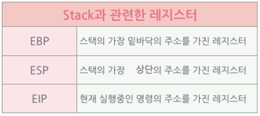
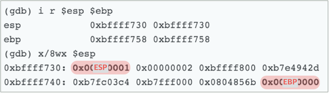

**출처 : [우리집에 GDB 있는데... 메모리 보고갈래? (2) - Hackerz on the Ship](https://bpsecblog.wordpress.com/2016/04/04/gdb_memory_2/)**

## Season 1. 우리집에 GDB있는데... 메모리 보고 갈래?
<br>

### DAY #2. 애프터 신청 (~~너~~ gdb 사용법, 갖고싶다.. 너란 stack)
<br>

<br>

```
//tomato.c

#include <string.h>
#include <stdio.h>'

void func2() {
	puts("func2()");
}

void sum(int a, int b) {
	printf("sum : %d\n", a+b);
	func2();
}

int main(int argc, char *argv[]) {

	int num=0;
	char arr[10];

	sum(1,2);
	strcpy(arr,argv[1]);
	printf("arr: %s\n", arr);
	if(num==1){
		system("/bin/sh");
	}
	return 0;
}
```
<br>

```
in09@ubuntu:~/bpsecblog/day2$ gcc -fno-stack-protector -o tomato tomato.c
```

>**-fno-stack-protector 옵션을 포함하는 이유**  
gcc가 스택을 보호하기 위해 ‘canary’라는 것을 삽입해요.  
함수 내에서 사용하는 스택 프레임과 return address 사이에  
canary를 넣어염.

>Buffer Overflow가 발생해 canary를 덮었을 때,  
이를 감지하고 프로그램을 강제 종료 해 버린답니당.

>이를 **SSP**(Stack Smashing Protection)이라고 해요.

>여기에선 오버플로우가 발생해도 프로그램이 강제 종료되지 않도록,  
**–fno-stack-protector** 옵션을 사용해 **보호기법을 해제**한겁니답.

>반대로 모든 프로시져에 이 **보호기법을 적용**하기 위해서는,  
**-fstack-protector-all** 옵션을 사용하세염

>[[Go to Watermelon]](https://bpsecblog.wordpress.com/2016/03/26/watermelon-feat-%ec%b6%9c%ec%a0%9c%ec%9e%90-in09/)  
(CodeGate2016 watermelon writeup에서  
canary에 대한 자세한 내용이 있으니 참고하셔도 좋습니당!)

<br>

이제 GDB를 활용해보도록 할까욤?

---

#### Ch 1. ~~너~~  gdb 사용법
<br>


> 하라니까 하겠는데.  
근데 GDB를 왜 써야되는데?

<br>

지..진정하세요.

gdb는 오픈소스로 공개되어있는 무료 디버거랍니다.  
아 디버거가 뭐냐거여?

님들 해답지보고 공부할 때,  
왜 이러저러하게 이 답이 도출이 되는지 보잖아요.

디버거도 그런검미다.  
코드에서 이 라인을 실행할 때, 어떤 값이 어떤 메모리 주소에 올라가고  
그 과정을 보여주는거져.

컴퓨터 계의 X-RAY랄까?  

gdb를 쓰면 물론 콘솔 기반이라.. 빡치긴 해여..  
ida 봐봐여… 아름답잖아요..

하지만 ELF 파일과 같은 Linux 기반의 실행파일을  
동적으로 따라가며 분석할 때 gdb 참 쓸만하져.

그래서 이거 씀미다.

긍까 쫄지말고 긔긔.

---

GDB로 tomato를 실행시켜봅시당.

```
in09@ubuntu:~/bpsecblog/day2$ gdb ./tomato
```

이건 그냥 gdb로 tomato에 붙은 것에 불과해여.  
아직 우리의 토마토는 실행되지 않았담미다.

일단 gdb 켜봤으면 뭐.. 어셈도 한번 봐주고,  
tomato를 실행하기 전에 이것 저것 설정도 해줘야쥬?

일단 보기 편하게 어셈 코드를 intel 형식으로 설정해  
main을 출력해 보겠습니답.ㅎㅎ

>**set disassembly-flavor [명령어 형식]**  
어셈블리 코드 문법을 설정하는 명령어.  
x86에서 Intel과 at&t 둘 중 하나를 골라 쓰면 됨.  
[명령어 형식의 예] : intel, att

>**disas [함수이름]**  
>함수의 어셈블리 코드를 보는 명령어.

```
(gdb) set disassembly-flavor intel  
(gdb) disas main  
      Dump of assembler code for function main:  
         0x080484e6 <+0>: push   ebp  
         0x080484e7 <+1>: mov    ebp,esp  
         0x080484e9 <+3>: and    esp,0xfffffff0  
         0x080484ec <+6>: sub    esp,0x20  
         0x080484ef <+9>: mov    DWORD PTR [esp+0x1c],0x0  
         0x080484f7 <+17>: mov    DWORD PTR [esp+0x4],0x2  
         0x080484ff <+25>: mov    DWORD PTR [esp],0x1  
         0x08048506 <+32>: call   0x80484c1 <sum>  
         0x0804850b <+37>: mov    eax,DWORD PTR [ebp+0xc]  
         0x0804850e <+40>: add    eax,0x4  
         0x08048511 <+43>: mov    eax,DWORD PTR [eax]  
         0x08048513 <+45>: mov    DWORD PTR [esp+0x4],eax  
         0x08048517 <+49>: lea    eax,[esp+0x12]  
         0x0804851b <+53>: mov    DWORD PTR [esp],eax  
         0x0804851e <+56>: call   0x8048360 <strcpy@plt>  
         0x08048523 <+61>: lea    eax,[esp+0x12]  
         0x08048527 <+65>: mov    DWORD PTR [esp+0x4],eax  
         0x0804852b <+69>: mov    DWORD PTR [esp],0x8048602  
         0x08048532 <+76>: call   0x8048350 <printf@plt>  
         0x08048537 <+81>: cmp    DWORD PTR [esp+0x1c],0x1  
         0x0804853c <+86>: jne    0x804854a <main+100>  
         0x0804853e <+88>: mov    DWORD PTR [esp],0x804860b  
         0x08048545 <+95>: call   0x8048380 <system@plt>  
         0x0804854a <+100>: mov    eax,0x0  
         0x0804854f <+105>: leave  
         0x08048550 <+106>: ret  
      End of assembler dump.
```

메인이 이렇게 구성되어 있네요.

main에 breakpoint를 걸고 한번 실행해 볼까요?

```
0x080484e6 <+0>: push   ebp
```

이게 main의 시작이잖아요?

>**b *[메모리주소]**  
breakpoint를 거는 명령.

>_[메모리 주소]_나 _[함수의 이름]_ 혹은,  
이를 기준으로 한 _[offset <+0>]_으로  
breakpoint를 걸어도 됩니당.

>\* breakpoint를 걸 땐, 주소 앞에 *를 붙이세요!

```
(gdb) b *main
Breakpoint 1 at 0x80484e6
(gdb) b *0x080484e6
Note: breakpoint 1 also set at pc 0x80484e6
Breakpoint 2 at 0x80484e6
(gdb) b *main+0
Note: breakpoints 1 and 2 also set at pc 0x80484e
Breakpoint 3 at 0x80484e6
```

모두 똑같은 곳에 breakpoint가 걸렸죠?
<br>

**breakpoint** 정보를 확인해볼게용


>**info b**  
breakpoint 정보를 열람할 수 있는 명령어

```
(gdb) info b
Num     Type           Disp Enb Address    What
1       breakpoint     keep y   0x080484e6 <main>
2       breakpoint     keep y   0x080484e6 <main>
3       breakpoint     keep y   0x080484e6 <main>
```
<br>

**Breakpoint**가 중복되니 삭제해보도록 하겠습니당

>**d (breakpoint 번호)**  
breakpoint를 삭제 할 수 있는 명령어

```
(gdb) d 2
(gdb) d 3
(gdb) info b
Num     Type           Disp Enb Address    What
1       breakpoint     keep y   0x080484e6 <main>
```
<br>

이제 **프로그램을 실행**해볼게요!  
이제야 비로소.. 아 토마토 다 뿔었겠네. ㅡㅡ

>**run [매개변수]**  
gdb 내부에서 프로그램 실행

```
(gdb) run aaaaaaaaaa
Starting program: /home/in09/bpsecblog/day2/tomato aaaaaaaaaa
Breakpoint 1, 0x080484e6 in main ()
(gdb)
```

헌데 명령행 인자로 main의 매개변수에 값이 넘어가죠?  
그래서 “aaaaaaaaa” 스트링을 넘겨준 거예요.

```
in09@ubuntu:~/bpsecblog/day2$ ./tomato aaaaaaaaaa
 sum : 3
 func2()
 arr: aaaaaaaaaa 
```

터미널에서 위와 같이 실행하는 것과 동일한거죠!
<br>

현재 우리 실행 흐름이 어디에 있는지 EIP를 확인해볼게요! Main에 멈춰있어야겠죠?

```
gdb) disas main
Dump of assembler code for function main:
=> 0x080484e6 <+0>: push   ebp
   0x080484e7 <+1>: mov    ebp,esp
   0x080484e9 <+3>: and    esp,0xfffffff
   0x080484ec <+6>: sub    esp,0x20
```

=> 화살표가 보이졍?  
아주 잘 멈춰져있네요.  
인스트럭션을 한줄 한줄 실행해볼게염.

>**ni**
다음 인스트럭션 실행

```
(gdb) ni
0x080484e7 in main ()
(gdb) ni
0x080484e9 in main ()
(gdb) disas main
Dump of assembler code for function main:
   0x080484e6 <+0>: push   ebp
   0x080484e7 <+1>: mov    ebp,esp
=> 0x080484e9 <+3>: and    esp,0xfffffff0
   0x080484ec <+6>: sub    esp,0x20
```

현재 EIP가 멈춰져있는 곳 이 전의 밑줄 친 _인스트럭션_을 보면,  
esp 값을 ebp 값에 저장하고 있죠?

esp, ebp는 스택과 관련한 레지스터잖아요!  
그 메모리에 어떤 값이 담겨있는지 gdb로 확인해보도록 하게씀미당.
<br>

그 전에 메모리 출력 방식에 대해 정리하고 가도록 할게요.  
**몇 바이트**만큼 그리고 **몇 진법**으로 출력할 것인지 정해 옵션을 주어 출력해 주면 됨미다.

```
(gdb) x/b 0x080484e6
0x80484e6 <main>: 0x55
(gdb) x/h 0x080484e6
0x80484e6 <main>: 0x8955
(gdb) x/w 0x080484e6
0x80484e6 <main>: 0x83e58955
```

해당 메모리 주소의 값을 각각 1바이트, 2바이트, 4바이트만큼 출력해주었습니다.

<br>

```
(gdb) x/x 0x080484e6
0x80484e6 <main>: 0x83e58955
(gdb) x/u 0x080484e6
0x80484e6 <main>: 2212858197
```

해당 메모리 주소 값을 16진수, 10진수로 출력해주었습니다.  
보통 이렇게들 씁니당.  
(진법 옵션이든 바이트 옵션이든 생략되면 이전 옵션으로 실행해줍니다.)

<br>

```
(gdb) x/wx 0x080484e6
0x80484e6 <main>: 0x83e58955
(gdb) x/4b 0x080484e6
0x80484e6 <main>: 0x55 0x89 0xe5 0x83
```

헙.. 근데 순서가 조금 이상하죠?
4바이트 출력한 것과 1바이트씩 4개를 출력한 것과 순서가 반대예요!
이것은 **바이트 오더링** 개념에 대해 이해를 해야 하는데요.

>**Byte Ordering [Big Endian / Little Endian]**  

>Intel CPU는 바이트를 배열할 때 _거꾸로 쓰게_ 됩니다.  
예를 들어 0x12345678을 저장한다고 하면, **0x78563412**와 같이 거꾸로 저장하게 됩니다.  
이를 **_Little Endian_**이라 지칭합니다.

>반면, gdb는 디버깅 시에 보기 편하게 하기 위해서  
Big Endian 형식으로 **0x12345678**와 같이 출력해주기 때문에,  
1바이트씩 출력할 때와 4바이트로 출력할 때 달리 보이는 거예요.

>• 참고로 네트워크 상에서는 _**Big Endian**_ 형식의 바이트 오더링을 사용합니다.

<br>

```
(gdb) x/4wx $esp
0xbffff6b8: 0x00000000 0xb7e2fa83 0x00000002 0xbffff754
```

특정 레지스터를 기준으로 메모리 값을 보고 싶으면,  
$register_name으로 출력해볼 수 있습니당.
<br>

다음은 ebp와 esp를 출력하는 것이고,  
info reg 혹은 i r은 레지스터 정보를 출력하는 명령입니답.

```
(gdb) x/wx $ebp
0xbffff6b8: 0x00000000
(gdb) x/wx $esp
0xbffff6b8: 0x00000000
(gdb) info reg $ebp
ebp            0xbffff6b8 0xbffff6b8
(gdb) i r $ebp $esp
ebp            0xbffff6b8 0xbffff6b8
esp            0xbffff6b8 0xbffff6b8
(gdb) i r
eax            0x2 2
ecx            0x7ce225d5 2095195605
edx            0xbffff6e4 -1073744156
ebx            0xb7fc0000 -1208221696
esp            0xbffff6b8 0xbffff6b8
ebp            0xbffff6b8 0xbffff6b8
esi            0x0 0
edi            0x0 0
eip            0x8048480 0x8048480 <main+3>
eflags         0x246 [ PF ZF IF ]
cs             0x73 115
ss             0x7b 123
ds             0x7b 123
es             0x7b 123
fs             0x0 0
gs             0x33 51
```

자.. 이제 gdb 사용법은 거진 다 익힌 것 같아요.

이제 우리 좀 더 알아가볼까요..?ㅎㅎ

---

####Ch 2. 갖고싶다.. 너란 stack..
<br>


*[그림 1] Stack과 관련한 레지스터*
<br>

• 현재 EIP 상황(main 2줄 실행)  

```
  0x080484e6 <+0>: push   ebp
  0x080484e7 <+1>: mov    ebp,esp
=>0x080484e9 <+3>: and    esp,0xfffffff0
  0x080484ec <+6>: sub    esp,0x20
  0x080484ef <+9>: mov    DWORD PTR [esp+0x1c],0x0
  0x080484f7 <+17>: mov    DWORD PTR [esp+0x4],0x2
  0x080484ff <+25>: mov    DWORD PTR [esp],0x1
  0x08048506 <+32>: call   0x80484c1 <sum>
```
<br>

#####1. 스택의 시작

>*PUSH EBP*  
*MOV EBP, ESP*

단 두 줄의 인스트럭션만 실행이 되었기 때문에 별 건 없져?  
하지만 저 단 두 줄의 어셈이 의미하는 바는 상당합니다.  
바로 =='스택(프레임)이 생성'==이 된다는 것이죠.

저 두 줄의 의미는,  
>=='함수가 실행이 될 때, 그 이전의 ebp(sfp)를 스택에 push하고  
현재 esp를 ebp에 저장하라.(새로운 ebp 생성!)'==

이라는 뜻임미당.
<br>

```
0x08048506 <+32>: call   0x80484c1 <sum>
```

여기에 breakpoint를 걸고 실행시킨 후 스택의 상황을 보겠습니답.  
breakpoint까지 한 번에 뛰려면 c 명령을 사용하면 됩니당.

```
(gdb) b *main+32
Breakpoint 2 at 0x8048506
(gdb) c
Continuing.
Breakpoint 2, 0x08048506 in main ()
(gdb) disas main
Dump of assembler code for function main:
  0x080484e6 <+0>: push   ebp
  0x080484e7 <+1>: mov    ebp,esp
  0x080484e9 <+3>: and    esp,0xfffffff0 
  0x080484ec <+6>: sub    esp,0x20
  0x080484ef <+9>: mov    DWORD PTR [esp+0x1c],0x0
  0x080484f7 <+17>: mov    DWORD PTR [esp+0x4],0x2
  0x080484ff <+25>: mov    DWORD PTR [esp],0x1
=>0x08048506 <+32>: call   0x80484c1 <sum>
```

원하는 곳에 멈춰잇쪄?

• sum이 call되기 전 상황

*[그림 2] sum이 call되기 전 상황*
<br>

그리고 sum 함수 안으로 들어가보도록 하겠습니다.  
call을 할 때는, 다음 인스트럭션의 주소를 스택에 쌓고 가죠?

```
0x08048506 <+32>: call   0x80484c1 <sum>
0x0804850b <+37>: mov    eax,DWORD PTR [ebp+0xc]
```

call sum에 breakpoint를 걸고 (0x080484c1)  
sum 안으로 들어가면,

**스택에 ESP(0x00000001)위에 0x0804850b가 쌓였을 거예여.**

확인해볼까욤?

• sum이 call된 후의 상황

*[그림 3] sum이 call된 후의 상황*
<br>

```
(gdb) x/10i $eip
=> 0x80484c1 <sum>: push   ebp
   0x80484c2 <sum+1>: mov    ebp,esp
   0x80484c4 <sum+3>: sub    esp,0x18
   0x80484c7 <sum+6>: mov    eax,DWORD PTR [ebp+0xc]
...생략...
(gdb) ni
```

sum 함수 안으로 들어왔쪄?

오 역시나..

```
Push ebp
mov  ebp, esp
```

하고 있어욤.

*Push ebp*를 실행하면,  
그 이전 스택 프레임(main)의 ebp가  
sum의 스택 프레임에 push될거예여.

즉, main의 ebp 0xbffff758가 esp에 들어가겠쬬?

```
(gdb) ni
(gdb) x/wx $esp
0xbffff728: 0xbffff758
```

오오… 마쟈마쟈ㅠㅠ

그리고 `mov ebp, esp`를 하면,  
현재 esp를 sum stack frame의 바닥

즉, sum의 ebp로 만들어주겠져?

그러므로 sum의 ebp에는 main의 ebp가 있게되겠져.


*[그림 4] sum 함수에 들어갔을 때 ebp의 변화*
<br>

이제 새로운 sum의 스택 프레임이 생성되었습니다!!  
확인해볼까요?

```
(gdb) x/15wx $ebp
0xbffff728: 0xbffff758 0x0804850b 0x00000001 0x00000002
0xbffff738: 0xbffff800 0xb7e4942d 0xb7fc03c4 0xb7fff000
0xbffff748: 0x0804856b 0x00000000 0x08048560 0x00000000
0xbffff758: 0x00000000 0xb7e2fa83 0x00000002
```
> 0xbffff758 : **sum의 stack frame**

> > 0x0804850b 0x00000001 0x00000002  
> 0xbffff800 0xb7e4942d 0xb7fc03c4 0xb7fff000  
> 0x0804856b 0x00000000 0x08048560 0x00000000  
> 0x00000000 : **main의 stack frame**

이제 새로운 sum의 스택 프레임이 생성되었습니다!!  
(현재 tomato.c에서 sum(1,2)라인이 실행 중이겠져?)
<br>

상단의 스택을 첫줄만 간추려보도록 하겠습니당.

```
0xbffff728: 0xbffff758 0x0804850b 0x00000001 0x00000002
```


*[그림 5] ebp를 기준으로 보쎄용*
<br>

보이심까?

>==새로운 스택 프레임의 ebp를 기준으로  
**return address**는 **ebp-4**,  
_매개인자_는 _ebp-8_, ebp -12와 같이 들어가게 됩니다!==

꼭 기억하세욤~
<br>

>**c**  
프로그램이 gdb로 run된 이후에  
다음 중단점까지 실행하는 명령어

```
(gdb) x/10i $eip
=> 0x80484c4 <sum+3>: sub    esp,0x18
   0x80484c7 <sum+6>: mov    eax,DWORD PTR [ebp+0xc]
   0x80484ca <sum+9>: mov    edx,DWORD PTR [ebp+0x8]
   0x80484cd <sum+12>: add    eax,edx
   0x80484cf <sum+14>: mov    DWORD PTR [esp+0x4],eax
   0x80484d3 <sum+18>: mov    DWORD PTR [esp],0x80485f8
   0x80484da <sum+25>: call   0x8048350 <printf@plt>
   0x80484df <sum+30>: call   0x80484ad <func2>
   0x80484e4 <sum+35>: leave 
   0x80484e5 <sum+36>: ret
(gdb) b *0x080484ad
Breakpoint 4 at 0x80484ad
(gdb) c
Continuing.
sum : 3
Breakpoint 4, 0x080484ad in func2 ()
(gdb) x/i $eip
=> 0x80484ad <func2>: push   ebp
(gdb) ni
0x080484ae in func2 ()
(gdb) x/i $eip
=> 0x80484ae <func2+1>: mov    ebp,esp
(gdb) ni
   0x080484b0 in func2 ()
```

자.. 또 sum 안에서 func2를 호출했어요.

그럼 아마 스택의 모습은  
**| func2 stack frame | sum stack frame | main stack frame|** 과 같이 되겠져?

확인해볼게염.

```
(gdb) x/23wx $ebp
0xbffff708: 0xbffff728 0x080484e4 0x080485f8 0x00000003
0xbffff718: 0x00000001 0x0804831d 0xbffff914 0x0000002f
0xbffff728: 0xbffff758 0x0804850b 0x00000001 0x00000002
0xbffff738: 0xbffff800 0xb7e4942d 0xb7fc03c4 0xb7fff000
0xbffff748: 0x0804856b 0x00000000 0x08048560 0x00000000
0xbffff758: 0x00000000 0xb7e2fa83 0x00000002 
```
>0xbffff728 : **func2의 stack frame**  
> >0x080484e4 0x080485f8 0x00000003  
> >0x00000001 0x0804831d 0xbffff914 0x0000002f  
> >0xbffff758 : **sum의 stack frame**  
> > >0x0804850b 0x00000001 0x00000002  
> > >0xbffff800 0xb7e4942d 0xb7fc03c4 0xb7fff000  
> > >0x0804856b 0x00000000 0x08048560 0x00000000  
> > >0x00000000 0xb7e2fa83 0x00000002 : **main의 stack frame**

시작이 있으면 끝이 있겠져?  
스택의 프레임이 시작되는,  
`Push ebp`  
`mov ebp, esp`를 자세히 살펴보았으니,

스택 프레임의 끝  
**Leave**, **Ret**을 살펴보도록 하겠습니다.

<br>

##### 2. stack의 끝
> **Leave**  
**Ret**

**• 현재 EIP 상황**

```
(gdb) disas func2
Dump of assembler code for function func2:
   0x080484ad <+0>: push   ebp
   0x080484ae <+1>: mov    ebp,esp
   0x080484b0 <+3>: sub    esp,0x18
   0x080484b3 <+6>: mov    DWORD PTR [esp],0x80485f0
   0x080484ba <+13>: call   0x8048370 <puts@plt>
=> 0x080484bf <+18>: leave 
   0x080484c0 <+19>: ret

```
<br>

**• _leave 실행 전의 스택 상황_**

```
(gdb) x/28wx $esp
0xbffff6f0: 0x080485f0 0x080485f8 0xbffff714 0xb7e63280
0xbffff700: 0x00000003 0xb7fff938 0xbffff728 0x080484e4
0xbffff710: 0x080485f8 0x00000003 0x00000001 0x0804831d
0xbffff720: 0xbffff914 0x0000002f 0xbffff758 0x0804850b
0xbffff730: 0x00000001 0x00000002 0xbffff800 0xb7e4942d
0xbffff740: 0xb7fc03c4 0xb7fff000 0x0804856b 0x00000000
0xbffff750: 0x08048560 0x00000000 0x00000000 0xb7e2fa83
(gdb) i r $ebp $esp
ebp            0xbffff708 0xbffff708
esp            0xbffff6f0 0xbffff6f0
```
>0x080485f0 0x080485f8 0xbffff714 0xb7e63280  
>0x00000003 0xb7fff938 0xbffff728 : **func2의 stack frame**  
> >0x080484e4  
> >0x080485f8 0x00000003 0x00000001 0x0804831d  
> >0xbffff914 0x0000002f 0xbffff758 : **sum의 stack frame**  
> > >0x0804850b  
> > >0x00000001 0x00000002 0xbffff800 0xb7e4942d  
> > >0xb7fc03c4 0xb7fff000 0x0804856b 0x00000000  
> > >0x08048560 0x00000000 0x00000000 : **main의 stack frame**

<br>

**• leave 실행 후의 스택 상황**

```
(gdb) ni
0x080484c0 in func2 ()
(gdb) x/20wx $esp
0xbffff70c: 0x080484e4 0x080485f8 0x00000003 0x00000001
0xbffff71c: 0x0804831d 0xbffff914 0x0000002f 0xbffff758
0xbffff72c: 0x0804850b 0x00000001 0x00000002 0xbffff800
0xbffff73c: 0xb7e4942d 0xb7fc03c4 0xb7fff000 0x0804856b
0xbffff74c: 0x00000000 0x08048560 0x00000000 0x00000000
(gdb) i r $ebp $esp
ebp            0xbffff728 0xbffff728
esp            0xbffff70c 0xbffff70c
```
>0x080484e4 0x080485f8 0x00000003 0x00000001  
>0x0804831d 0xbffff914 0x0000002f 0xbffff758 : **sum의 stack frame**  
> >0x0804850b 0x00000001 0x00000002 0xbffff800  
> >0xb7e4942d 0xb7fc03c4 0xb7fff000 0x0804856b  
> >0x00000000 0x08048560 0x00000000 0x00000000 : **main의 stack frame**

**Leave** 실행 후에 **func2의 stack frame**이 모두 정리된 것 보이시나여?  
그리고 ebp가 sum의 ebp로 바뀌고,  
esp도 sum의 esp로 바뀌었습니다.

그리고 **Ret**을 만나면 **0x080484e4로 리턴**해 나머지 sum의 인스트럭션을 실행하고,  
끝으로 sum의 stack frame도 정리되고 나머지 main의 인스트럭션을 실행한 후  
프로그램을 종료하는 것이겠씀미다아아~

쟈아아아 오늘은 gdb도 써보거 스택에 대해서도 자세히 알아보았눈데,  
어떠셔쎄여?

다음 번엔 좀 더 다이나믹한 데이트를 합씨당.  
아 물론 데이트 코스는 제가 짭니당. \^ㅠ^
<br>

*다음 포스팅 예고*


그럼 이만 뿅!